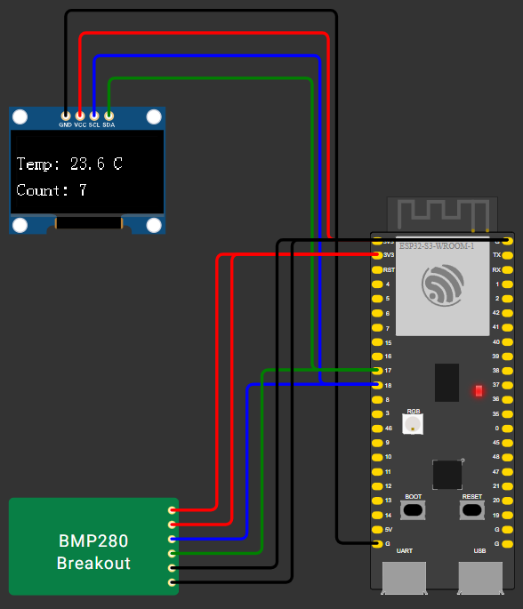

# 📟 Heltec WiFi LoRa 32 V4 — BMP280 + OLED

<p align="center">
  
</p>

<p align="center">
  
  
  
  
</p>

Прошивка на **ESP-IDF** для платы **Heltec WiFi LoRa 32 V4**: опрашивает датчик температуры **BMP280** по I2C и выводит показания на **OLED-дисплей SSD1306**. Проект собирается через **VS Code + PlatformIO** и полностью симулируется в **Wokwi**.

---

## 📋 Содержание

1. [Возможности](#-возможности)
2. [Схема подключения](#-схема-подключения)
3. [Установка PlatformIO](#1-установка-platformio)
4. [Создание проекта](#2-создание-проекта)
5. [Настройка Wokwi](#3-настройка-wokwi)
6. [Сборка и загрузка](#4-сборка-и-загрузка)
7. [Возникают ошибки?](#-возникают-ошибки)

---

## ✨ Возможности

- Чтение температуры с **BMP280** по I2C
- Вывод температуры и счётчика измерений на **OLED SSD1306**
- Опрос датчика каждые 2 секунды с логированием в UART
- Полная симуляция в **Wokwi**
- Настраиваемый диапазон и период изменения температуры в симуляции через `diagram.json`

---

## 🔌 Схема подключения

| Сигнал | Pin ESP32-S3 | OLED SSD1306 | BMP280 |
|--------|:---:|:---:|:---:|
| SDA    | GPIO17 | SDA | SDA |
| SCL    | GPIO18 | SCL | SCL |
| 3V3    | 3V3    | VCC | VCC, CSB |
| GND    | GND    | GND | GND, SDO |
| Reset  | GPIO21 | RST | — |
| VEXT   | GPIO36 | (питание платы) | — |

> `SDO → GND` задаёт I2C-адрес BMP280 `0x76`; при `SDO → VCC` адрес будет `0x77`

---

## 1. Установка PlatformIO

Установите расширение **PlatformIO** через маркетплейс VS Code

`VS Code` → `Extensions` → `PlatformIO` → `Download`

---

## 2. Создание проекта

Откройте терминал PlatformIO одним из способов

- `PlatformIO` → `Quick Access` → `Miscellaneous` → `New Terminal`
- `VS Code` → `Ctrl + Shift + P` → `PlatformIO: New Terminal`

Затем выполните команды

```bash
pio project init -b heltec_wifi_lora_32_V3 -O "framework=espidf"
pio pkg update
```

---

## 3. Настройка Wokwi

*Wokwi — расширение VS Code для симуляции платы без физического устройства*

### Установка Wokwi

Установите расширение **Wokwi** через маркетплейс VS Code

`VS Code` → `Extensions` → `Wokwi Simulator` → `Download`

---

### Компиляция (PowerShell)

```bash
iwr https://wokwi.com/ci/install.ps1 -useb | iex
wokwi-cli chip compile bmp280.chip.c -o bmp280.chip.wasm
```

Параметры симуляции задаются в `diagram.json` для чипа `chip-bmp280`:

| Параметр | Назначение | По умолчанию |
|---|---|---|
| `minTemperature` | нижняя граница диапазона, °C | 18 |
| `maxTemperature` | верхняя граница диапазона, °C | 30 |
| `updateIntervalMs` | период обновления значения, мс | 2000 |

---

## 4. Сборка и загрузка

Финальный шаг — собрать и загрузить проект

**`Build`** → **`Upload`**

> Смотреть логи можно через `Serial Monitor` (Ctrl+Alt+S)

✅ Готово

---

## 🛠️ Возникают ошибки?

Удалите артефакты сборки и повторите сборку заново

- `.pio`
- `.vscode`
- `managed_components`
- `sdkconfig.heltec_wifi_lora_32_V3`

```bash
pio run -t clean
```