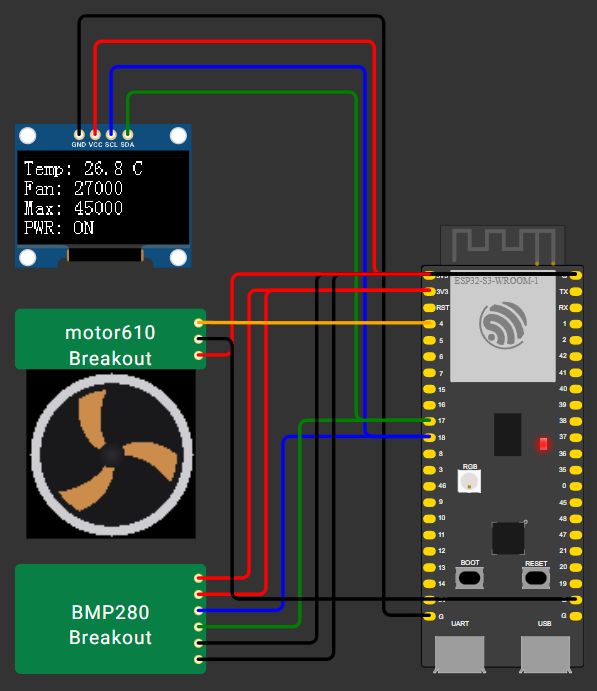
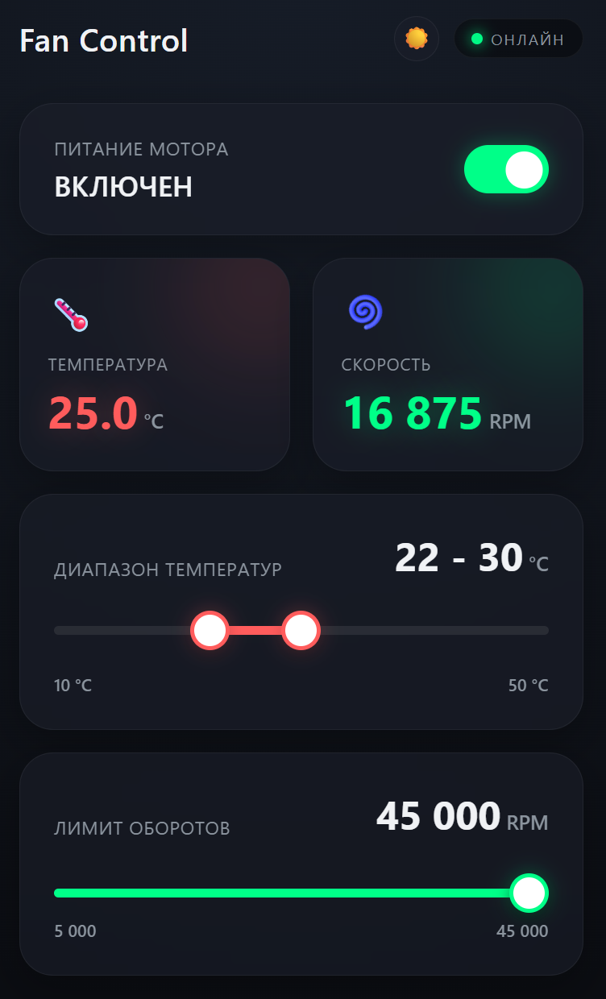

# 📟 Heltec WiFi LoRa 32 V4 — BMP280 + OLED + motor610 + Wi-Fi дашборд

<p align="center">
  
</p>

<p align="center">
  
  
  
  
</p>

Прошивка на **ESP-IDF** для платы **Heltec WiFi LoRa 32 V4**: опрашивает датчик температуры **BMP280** по I2C, выводит показания на **OLED-дисплей SSD1306**, управляет скоростью вентилятора **motor610** через ШИМ в зависимости от температуры и поднимает **Wi-Fi веб-дашборд** для мониторинга и управления в реальном времени. Проект собирается через **VS Code + PlatformIO** и полностью симулируется в **Wokwi**.

---

## 📋 Содержание

1. [Возможности](#-возможности)
2. [Схема подключения](#-схема-подключения)
3. [Веб-дашборд](#-веб-дашборд)
4. [Настройка PlatformIO](#1-настройка-platformio)
5. [Настройка Wokwi](#2-настройка-wokwi)
6. [Сборка и загрузка](#3-сборка-и-загрузка)
7. [Возникают ошибки?](#-возникают-ошибки)

---

## ✨ Возможности

- Чтение температуры с **BMP280** по I2C
- Вывод температуры, скорости вентилятора и режима питания на **OLED SSD1306**
- Автоматическое управление вентилятором **motor610** через аппаратный ШИМ по настраиваемому температурному диапазону
- Опрос датчика каждые **100 мс** — показания в дашборде и на OLED обновляются практически мгновенно
- Управление системой через **Wi-Fi веб-дашборд**
- Полная симуляция в **Wokwi**, включая доступ к дашборду через проброс порта
- Светлая/тёмная тема интерфейса дашборда

---

## 🔌 Схема подключения

| Сигнал | Pin ESP32-S3 | OLED SSD1306 | BMP280 | motor610 |
|--------|:---:|:---:|:---:|:---:|
| SDA    | GPIO17 | SDA | SDA | — |
| SCL    | GPIO18 | SCL | SCL | — |
| 3V3    | 3V3    | VCC | VCC, CSB | V |
| GND    | GND    | GND | GND, SDO | G |
| Reset  | GPIO21 | RST | — | — |
| VEXT   | GPIO36 | питание платы | — | — |
| PWM | GPIO4 | — | — | S |

> `SDO → GND` задаёт I2C-адрес BMP280 `0x76`; при `SDO → VCC` адрес будет `0x77`

> Вентилятор **motor610** — coreless-моторчик с встроенным MOSFET-драйвером на плате модуля: питание (`V`/`G`) берётся напрямую с линии 3V3/GND, а пин `S` принимает слабый ШИМ-сигнал с GPIO4. Подробные характеристики и распиновка модуля — в [`motor610.md`](motor610.md).

---

## 🌐 Веб-дашборд

<p align="center">
  
</p>

При старте прошивка поднимает Wi-Fi в режиме **AP+STA** и веб-сервер (HTTP + WebSocket) с дашбордом:

- **Точка доступа (AP)**: SSID `Heltec_ESP32`, пароль `12345678` — работает как в симуляции, так и на реальном железе.
- **Станция (STA)**: плата также пытается подключиться к сети `Wokwi-GUEST` — это виртуальная сеть, которую Wokwi предоставляет только внутри симуляции.

**Адрес дашборда отличается** в симуляции и на реальном устройстве:

| Где | Пояснение | Адрес дашборда |
|---|---|---|
| Симуляция Wokwi | Порт пробрасывается через `wokwi.toml` (`localhost:8180` → `target:80`) | http://localhost:8180 |
| Реальное железо | Подключите устройство к Wi-Fi сети `Heltec_ESP32` (пароль `12345678`) | http://192.168.4.1 |

Возможности дашборда:

- Включение/выключение вентилятора
- Текущие температура и обороты в реальном времени (обновление по WebSocket)
- Лимит максимальных оборотов вентилятора в диапазоне 5000–45000 об/мин
- Границы температурного диапазона автоуправления (по умолчанию 22–30 °C, регулируются в пределах 10–50 °C)
- Переключение светлой/тёмной темы интерфейса

> Все настройки, заданные через дашборд (лимит оборотов, диапазон температур, питание), хранятся только в оперативной памяти платы и сбрасываются к значениям по умолчанию при перезагрузке.

---

## 1. настройка PlatformIO

Установите расширение **PlatformIO** через маркетплейс VS Code

`VS Code` → `Extensions` → `PlatformIO` → `Download`

Откройте терминал PlatformIO одним из способов

- `PlatformIO` → `Quick Access` → `Miscellaneous` → `New Terminal`
- `VS Code` → `Ctrl + Shift + P` → `PlatformIO: New Terminal`

Затем выполните команды

```bash
pio project init -b heltec_wifi_lora_32_V3 -O "framework=espidf"
pio pkg update
```

---

## 2. Настройка Wokwi

*Wokwi — расширение VS Code для симуляции платы без физического устройства*

Установите расширение **Wokwi** через маркетплейс VS Code

`VS Code` → `Extensions` → `Wokwi Simulator` → `Download`

Скомпилируйте файлы кастомных чипов

```bash
iwr https://wokwi.com/ci/install.ps1 -useb | iex
wokwi-cli chip compile bmp280.chip.c -o bmp280.chip.wasm
wokwi-cli chip compile motor610.chip.c -o motor610.chip.wasm
```

Параметры симуляции задаются в `diagram.json`.

Для чипа `chip-bmp280`:

| Параметр | Назначение | По умолчанию |
|---|---|---|
| `temperature` | температура, которую «видит» датчик, °C — задаётся вручную слайдером на самом чипе в Wokwi | 25 (диапазон слайдера: 15–35) |
| `updateIntervalMs` | как часто чип перечитывает положение слайдера и обновляет регистры данных, мс | 100 |

> Температура выставляется вручную слайдером `Temperature (°C)` во время симуляции — кликните по чипу BMP280 в Wokwi, чтобы открыть панель управления.

Для чипа `chip-motor610`:

| Параметр | Назначение | По умолчанию |
|---|---|---|
| `maxRpm` | максимальная скорость вентилятора, об/мин | 45000 |
| `smoothingMs` | сглаживание изменения скорости при отклике на ШИМ, мс | 250 |

> Обороты вентилятора ограничены переменной `motor610_max_rpm`, которую можно менять на лету двумя независимыми способами: слайдером `Max RPM` самого чипа в Wokwi (визуально изменяет Max RPM) и через [веб-дашборд](#-веб-дашборд) (лимит, который прошивка накладывает поверх этого потолка — работает как в симуляции, так и на реальном железе). Значение не сохраняется между перезагрузками платы.

---

## 3. Сборка и загрузка

Финальный шаг — собрать и загрузить проект

**`Build`** → **`Upload`**

> Смотреть логи можно через `Serial Monitor` (Ctrl+Alt+S)

✅ Готово

---

## 🛠️ Возникают ошибки?

Удалите артефакты сборки и повторите сборку заново

- `.pio`
- `.vscode`
- `managed_components`
- `sdkconfig.heltec_wifi_lora_32_V3`

```bash
pio run -t clean
```